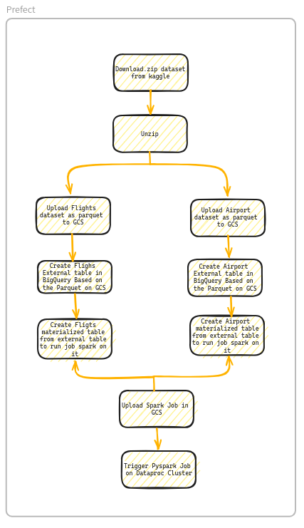

# Flights Data pipeline

## Table Of Contents

- 1. [Problem Description](#1-Problem-Description)
- 2. [Objecive](#2-Problem-Description)
- 3. [Technologies](#3-Technologies)
- 4. [Data Source](#4-Data-Source)
- 5. [Architecture](#5-Architecture)
- 6. [Data Workflow](#6-Data-Workflow)
- 7. [Dashboard](#7-Dashboard)
 

## 1. Problem Description

The aim of this project is to create a data pipeline that takes the Kaggle dataset of sample flights and airports and produces a visualization of airlines used, tourism between different countries, Price per these flights and most flights takeoff cities,airports and countries and most landed cities,airports and countries. This information is fully based in this dataset, so it can be a nice demonstration of the use of data engineering tools, and In case I have airline data i can fully visuallize the most important aspects of these data.

## 2. Objective
Develop a Data Pipeline to handle ingestion, processing and serving to analytics tools such as google looker studio, Create a dashboard for users or stalkholer to fully understand and use these analytics to know profit, what airlines people loves to travel with and what most visited country in this year *"In Case i have the timestamp information in the data"*

## 3. Technologies
Below tools have been used for this project:
- **Data pipeline Scripts** Python 3.11
- **Workflow orchestration:** Prefect
- **Data Lake:** Google Cloud Storage (GCS)
- **Data Warehouse:** BigQuery
- **Transformations:** Apache Spark
- **Cloud Apache Cluster:** Google Dataproc
- **Visualization:** Google Looker Studio
  
## 4. Data Source
- Datasets was taken from [Flight Data](https://www.kaggle.com/datasets/salikhussaini49/flight-data/data):
  >1. **Airports.csv**
  >2. **Flights(2).csv**

## 5. Architecture

## 6. Data Wokflow

## 7. Dashboard
